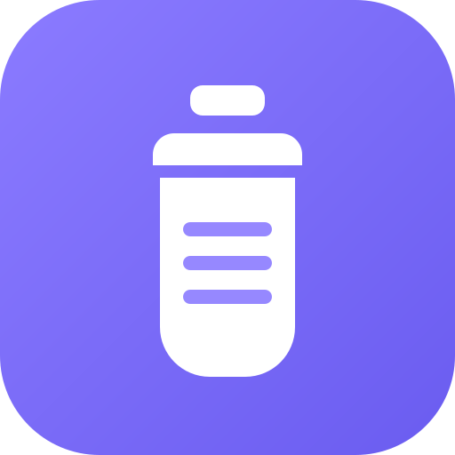

# 🍼 Little Log — Baby Tracker

A clean, modern web app for tracking your baby's daily stats — diapers, feedings,
sleep, pumping, solids, growth and more. Built mobile-first so it's fast and pleasant
to use one-handed on a phone, and it looks just as good on a laptop.



## Features

- **Fast logging** — tap the ➕ button and record an entry in seconds with simple
  forms, steppers and dropdowns. Everything is tuned for quick, one-handed use.
- **Track everything that matters:**
  - 🧷 Diapers (wet / dirty / both / dry)
  - 🤱 Nursing (side + duration)
  - 🍼 Bottle feeds (amount + contents)
  - 💧 Pumping (side + amount + duration)
  - 😴 Sleep (with "still sleeping" tracking)
  - 🥣 Solids
  - 📏 Growth (weight, length, head circumference)
  - 🌡️ Temperature
  - 💊 Medications
  - 📝 Notes
- **Dashboard** — "time since last feed / diaper / sleep", today's totals at a glance,
  and a live timeline of the day.
- **History** — every entry grouped by day with per-type filters. Tap any entry to
  edit or delete it.
- **Stats** — daily averages plus 7 / 14 / 30-day trend charts for diapers, feeds,
  sleep and bottle intake.
- **Units your way** — ml/oz, kg/lb, cm/in, °C/°F.
- **Light & dark themes** (auto, light or dark).
- **Installable PWA** — "Add to Home Screen" on your phone for an app-like experience.
- **Private by default** — all data is stored locally on your device
  (`localStorage`). Nothing is sent to any server. Back up or move devices with
  one-tap JSON **export / import** in Settings.

## Tech stack

- [Next.js 16](https://nextjs.org/) (App Router) + React 19
- TypeScript
- Tailwind CSS v4

## Getting started

```bash
npm install
npm run dev
```

Open [http://localhost:3000](http://localhost:3000). On your phone, open the same URL
and use your browser's **Add to Home Screen** option to install it.

## Build for production

```bash
npm run build
npm run start
```

The app is fully static/client-rendered and deploys anywhere that hosts a Next.js app
(e.g. Vercel, Netlify).

## A note on data & sync

Data lives on the device it was entered on. To share between two phones (e.g. both
parents), use **Settings → Export** on one device and **Import** on the other. A
future version could add optional cloud sync with accounts — the data layer in
`src/lib/store.tsx` is isolated to make that swap straightforward.
